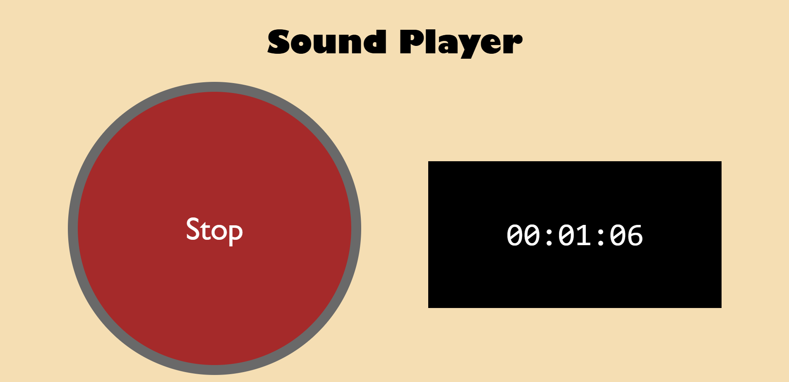
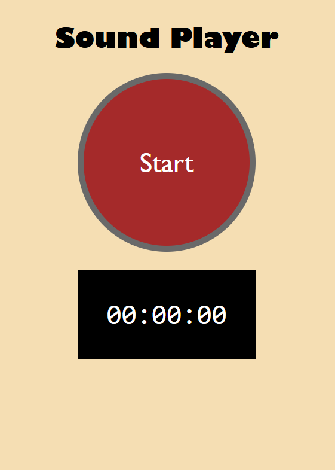

# Interval Timer

> A simple interval timer website that plays a sound every minute, and a different sound every 5 minutes

## Why

Keeping track of time is hard, especially when you can't constantly look at a clock. This website plays a sound every minute, and a louder sound every 5 minutes. It also has a stopwatch that you can look at if you lose track of time.

## Features

  * Plays a sound every minute
  * Plays a different sound every 5 minutes
  * Stopwatch for tracking elapsed time

## Screenshots

### 🖥️ Desktop

  

### 📱 Mobile

  

## Usage

  1. Open `index.html` in your browser
  2. Start the timer
  3. Let it run in the background

## Disclaimer

This website is just for fun. I self-hosted it so that the internet doesn't have to be cursed with its presence.
